title: Rust
class: animation-fade, dark-mode
layout: true

<!-- This slide will serve as the base layout for all your slides -->
<!-- .bottom-bar[
  {{title}}
] -->

---

class: impact, dark-mode-cog

# .oxide[{{title}}]
## The programming language that **empowers** everyone
<!-- ### - Rahul Thakoor -->

---
class:middle
# Who am I?

## .big[👋 Hi! I'm Rahul]

--
- Student at SUPINFO International University
--

- Creating **rust_gpiozero**
--

- Physical computing with Rust

--

- **Increasing Rust's Reach 2018**


---
class:center,middle


---

# Agenda

- What is Rust?
- Some similarities with other languages?
- What makes Rust somewhat unique?
- What is unique about Rust?
- Beyond the Language
- Beyond the Code
- Who is using Rust?
- How you can get started?

---
class: center, middle
# .big[**Giveaway 🎉**]

--

.sponsor[![integer 32][i32]]

## World's first Rust consultancy company

---
# Rust in Motion

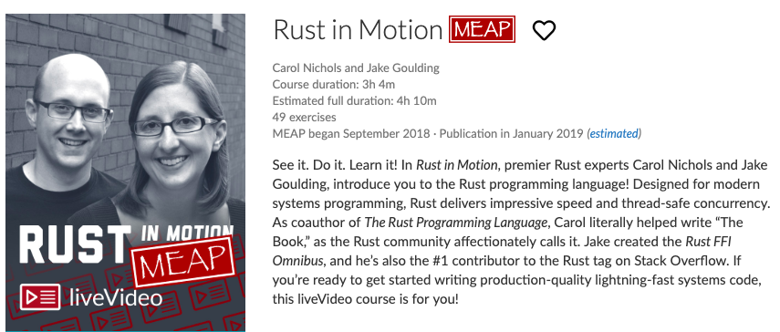
---

class: impact, dark-mode-cog

# .oxide[What is Rust?]

---
class: center, middle
  ![metal][metal]


---
class: center, middle
.x[![wd40][wd40]]

  [	Jorge Barrios](http://tools.wikimedia.de/~daniel/WikiSense/Gallery.php?wikifam=commons.wikimedia.org&wikilang=en&order=-img_timestamp&img_user_text=Jorgebarrios&ofs=0&max=250)

---
class: center, middle

.huge[**programming language**<br>]
--
.big[**speed**<br>]
--

.big[**safety**<br>]
--

.big[**concurrency**]


---
# Speed

.center.middle[]

---
# Speed

.center[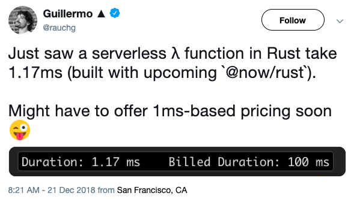]


---
# Safety

> Guarantees memory safety

--

You will never endure:

- a dangling pointer
- a use-after-free
- any other kind of Undefined Behavior.


---
# Concurrency


> Fearless concurrency

- Message passing
- Shared State
- Extensible Concurrency


???
Concurrent programming, where different parts of a program execute independently

---
class: center, middle

.huge[**Empowering** everyone to build reliable and efficient software.]

???

Rust allows you to build skills that transfer from one domain to another; you can learn Rust by writing a web app, then apply those same skills to target your Raspberry Pi

---
.center[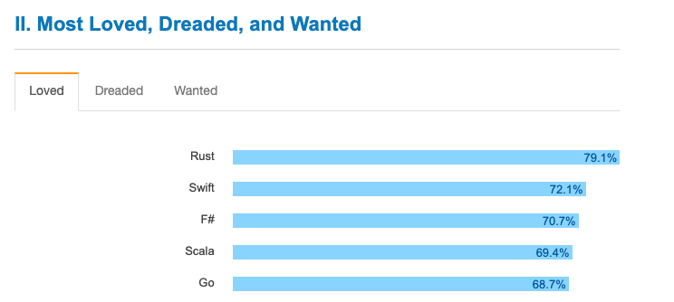]

Stack Overflow Developer Survey 2016
---
.center[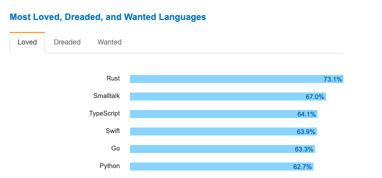]

Stack Overflow Developer Survey 2017
---
.center[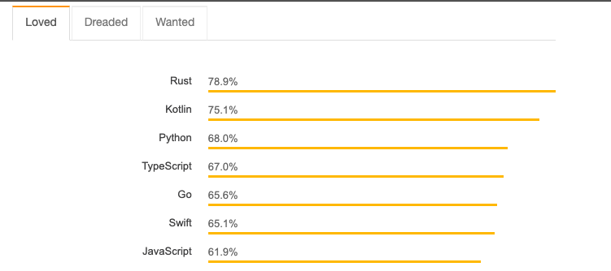]

Stack Overflow Developer Survey 2018
---
.center[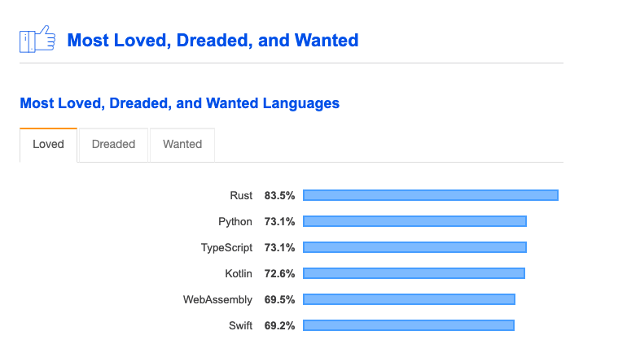]

Stack Overflow Developer Survey 2019
---
class: impact, dark-mode-cog

# .oxide[Hello Rust]

---
class: dark-mode-cog,light-bg

.center[]

---
.center[]
http://rustacean.net/

---
class: center, middle

<!--  -->

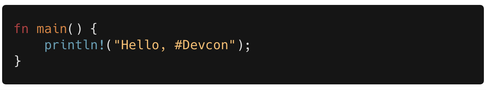 

---
class: impact, dark-mode-cog

# .oxide.small[Some similarities with other languages?]

---

# Variables
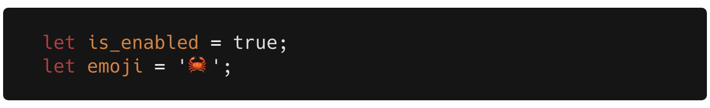 

???
```rust
  let is_enabled = true;
  let emoji = '🦀';
```

---

# Statically, strongly typed
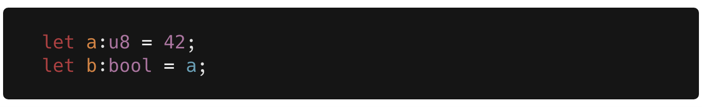 
???
```rust
  let a:u8 = 42;
  let b:bool = a;
```

--
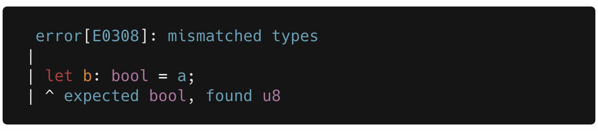 
???
```
error[E0308]: mismatched types
 |
 | let b: bool = a;
 | ^ expected bool, found u8
```

---

# Control flow

## if / while

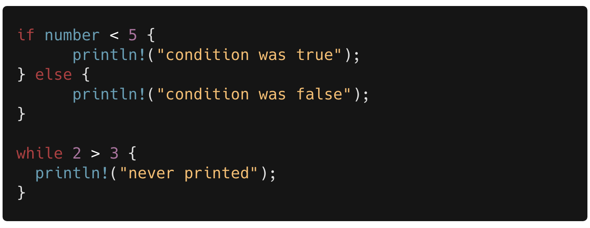 

???
```rust
  if number < 5 {
        println!("condition was true");
  } else {
        println!("condition was false");
  }
```
```rust
while 2 > 3 { 
  println!("never printed");
}
```

---

# Control flow

## for / loop
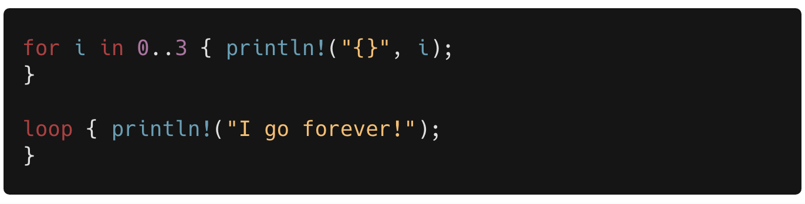 

???
```rust
for i in 0..3 { println!("{}", i);
}
```

```rust
loop { println!("I go forever!");
}
```

---

# Functions

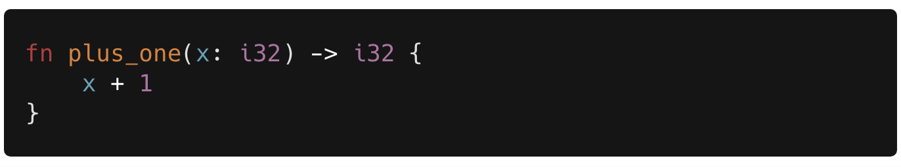 

--
- return early using `return` keyword
- return the last expression implicitly

???
```rust
fn plus_one(x: i32) -> i32 {
    x + 1
}
```

---

# Structs

- custom data type that lets you name and package together multiple related values
- like data attributes in OOP

--

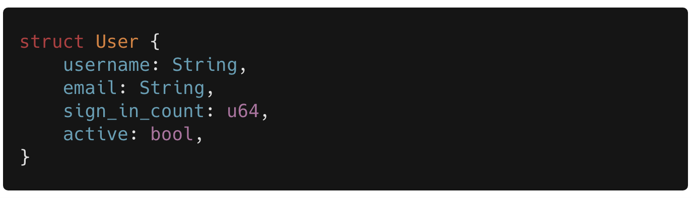 

???
```rust
struct User {
    username: String,
    email: String,
    sign_in_count: u64,
    active: bool,
}
```

.small[source: https://doc.rust-lang.org/stable/book]
---

# Methods

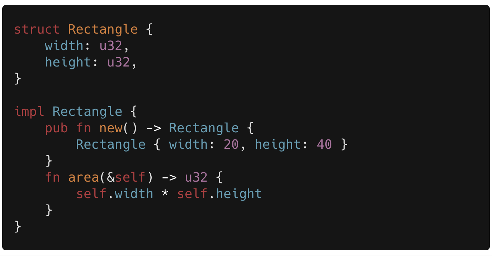 

???
```rust
struct Rectangle {
    width: u32,
    height: u32,
}

impl Rectangle {
    pub fn new() -> Rectangle {
        Rectangle { width: 20, height: 40 }
    }
    fn area(&self) -> u32 {
        self.width * self.height
    }
}
```
---
# Calling Methods

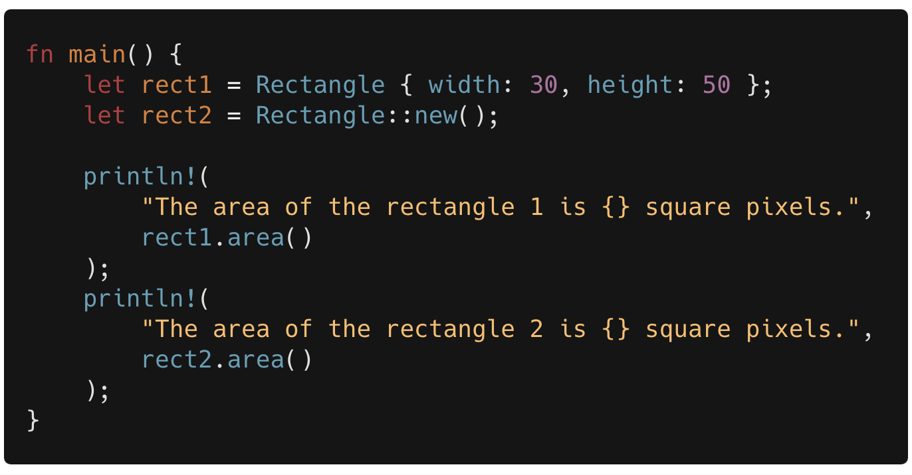 

???
```rust
fn main() {
    let rect1 = Rectangle { width: 30, height: 50 };
    let rect2 = Rectangle::new();

    println!(
        "The area of the rectangle 1 is {} square pixels.",
        rect1.area()
    );
    println!(
        "The area of the rectangle 2 is {} square pixels.",
        rect2.area()
    );
}
```

.small[source: https://doc.rust-lang.org/stable/book]


---
# Generics

- abstract stand-ins for concrete types or other properties

--
 


???
```rust
struct Point<T> {
    x: T,
    y: T,
}

fn main() {
    let integer = Point { x: 5, y: 10 };
    let float = Point { x: 1.0, y: 4.0 };
}
```

.small[source: https://doc.rust-lang.org/stable/book]

---
# Traits

- Define shared behaviour
- similar to interfaces in other languages
--

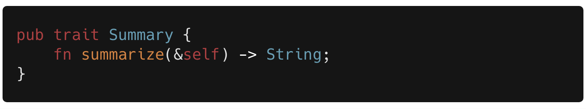 

???
```rust
pub trait Summary {
    fn summarize(&self) -> String;
}
```

---
class: impact, dark-mode-cog

# .oxide.small[What makes Rust somewhat unique?]

---

# Variables are immutable by default

--
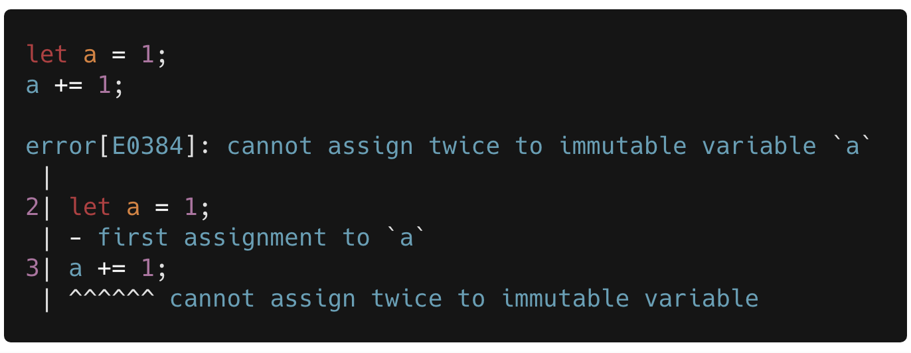 

--

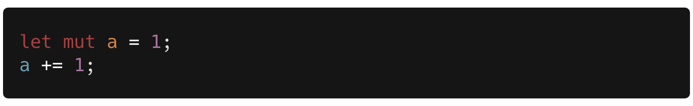 


???
```rust
let a = 1;
a += 1;
```

```
error[E0384]: cannot assign twice to immutable variable `a`
 |
2| let a = 1;
 | - first assignment to `a`
3| a += 1;
 | ^^^^^^ cannot assign twice to immutable variable

```

```rust
let mut a = 1;
a += 1;
```


---
# No garbage collector
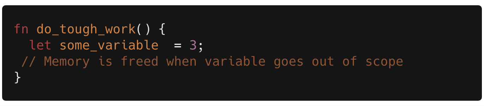 

--
## Resource Acquisition Is Initialization (RAII)

???
```rust

fn do_tough_work() {
  let some_variable  = 3;
 // Memory is freed when variable goes out of scope
}
```

---

# No NULL

- There is no implicit NULL, null, nil, None, undefined, etc

--
> I call it my billion-dollar mistake. ~ Tony Hoare, 2009


---
# Enum

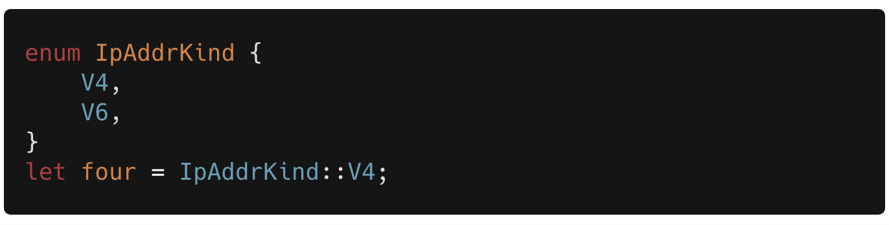 

???
```rust
enum IpAddrKind {
    V4,
    V6,
}
let four = IpAddrKind::V4;

```

--

###Option

--
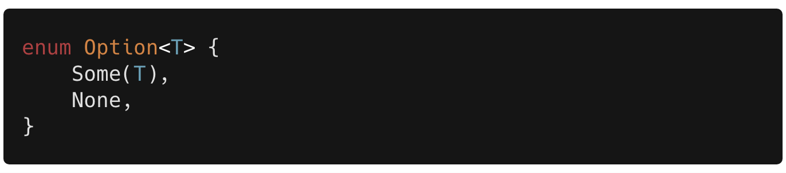 

???
```rust
enum Option<T> {
    Some(T),
    None,
}
```

---


# Pattern matching

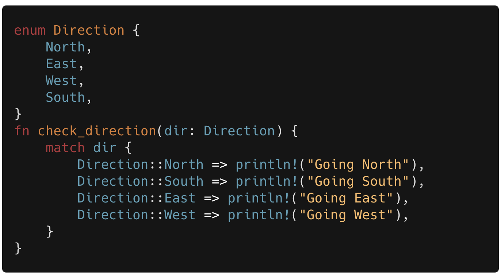 

???
```rust
enum Direction {
    North,
    East,
    West,
    South,
}
fn check_direction(dir: Direction) {
    match dir {
        Direction::North => println!("Going North"),
        Direction::South => println!("Going South"),
        Direction::East => println!("Going East"),
        Direction::West => println!("Going West"),
    }
}
```
.small[source: https://doc.rust-lang.org/stable/book]

---
# Error Handling
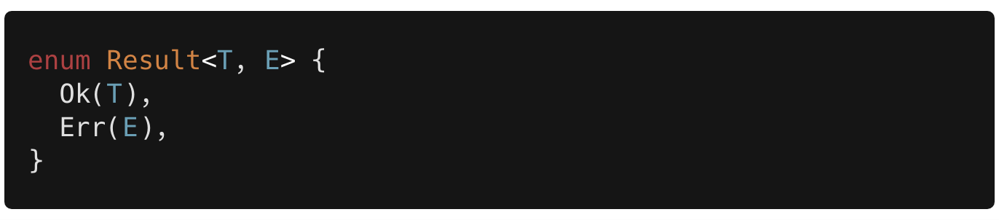 

???
```rust
enum Result<T, E> { 
  Ok(T), 
  Err(E),
}
```
---
# Error Handling

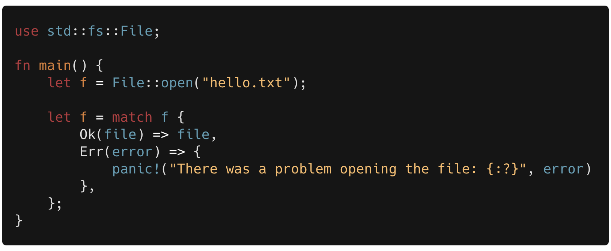 
???
```rust
use std::fs::File;

fn main() {
    let f = File::open("hello.txt");

    let f = match f {
        Ok(file) => file,
        Err(error) => {
            panic!("There was a problem opening the file: {:?}", error)
        },
    };
}
```
.small[source: https://doc.rust-lang.org/stable/book]

---

# Functional Language Features
--

## Closures

- anonymous functions you can save in a variable or pass as arguments to other functions

--

## Iterators
- processing a series of items
- in Rust they are **lazy** 

---
# Macros
- metaprogramming

--

## Declarative macros

--

## Procedural macros

---

class: impact, dark-mode-cog

# .oxide.small[What makes Rust unique?]

---

# Ownership

- Each value in Rust has a variable that’s called its **owner**.
- There can only be **one** owner at a time.
- When the owner goes out of scope, the value will be **dropped**.

---

# Borrowing

- At any given time, you can have either **one mutable** reference or **any number of immutable references**.
- References must always be **valid**.

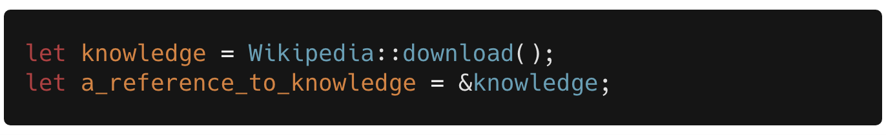
???
```rust
let knowledge = Wikipedia::download();
let a_reference_to_knowledge = &knowledge;
```
---

# Borrowing

- At any given time, you can have either **one mutable** reference or **any number of immutable references**.
- References must always be **valid**.

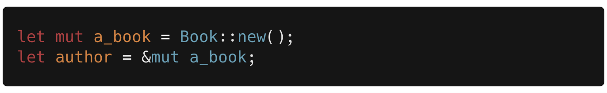

???
```rust
let mut a_book = Book::new();
let author = &mut a_book;
```

---
# Borrowing

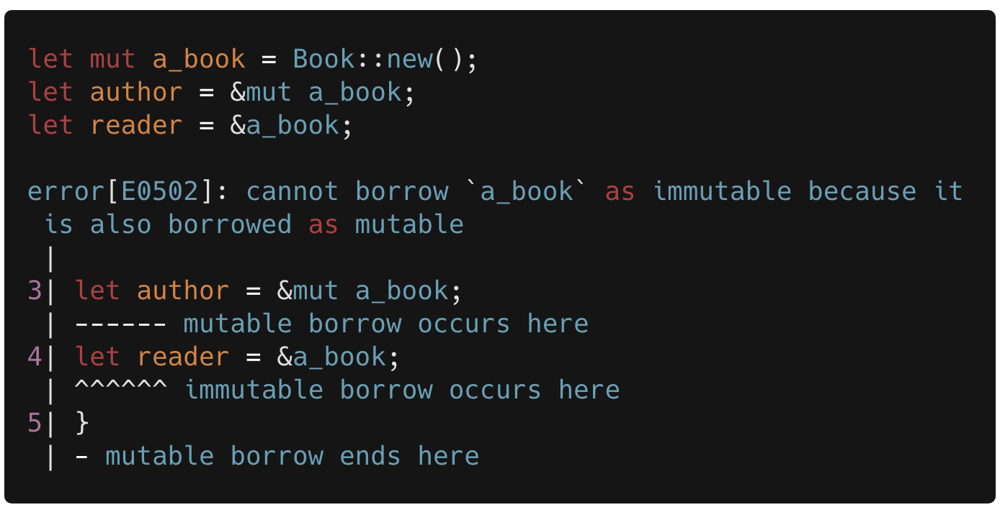

???
```rust
let mut a_book = Book::new();
let author = &mut a_book;
let reader = &a_book;
```

```
error[E0502]: cannot borrow `a_book` as immutable because it
 is also borrowed as mutable
 |
3| let author = &mut a_book;
 | ------ mutable borrow occurs here
4| let reader = &a_book;
 | ^^^^^^ immutable borrow occurs here
5| }
 | - mutable borrow ends here
 ```


---

class: center, middle

# Beyond the language

---

# Cargo

A build and dependency management tool in one.
- new
- build
- run
- test
- doc
- publish

---

# Crates
.center[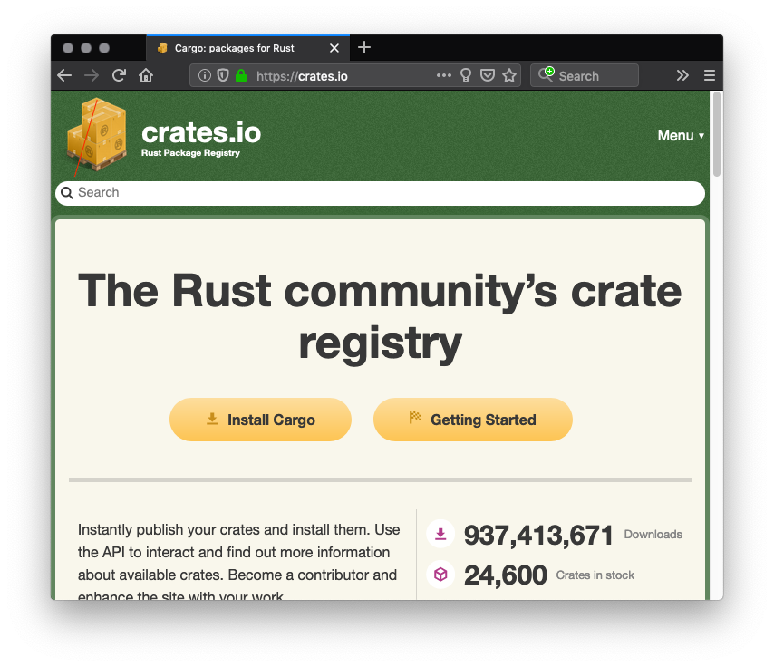 ]

---

# Testing
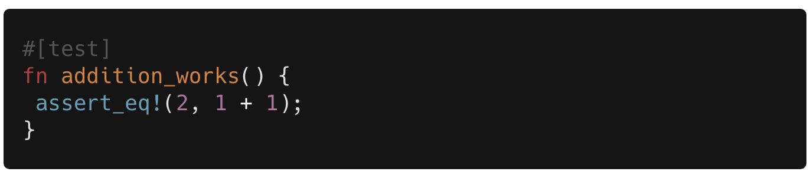


???
```rust
#[test]
fn addition_works() {
 assert_eq!(2, 1 + 1);
}
```

---

# Documentation
.center[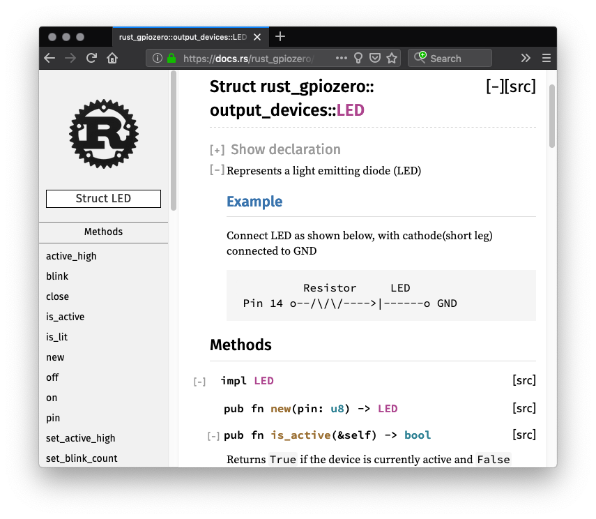 ]

???
```rust
/// Returns True if the device is currently active and False otherwise.
pub fn is_lit(&self) -> bool {
    self.is_active()
}

```


---

# Developer tools

## clippy

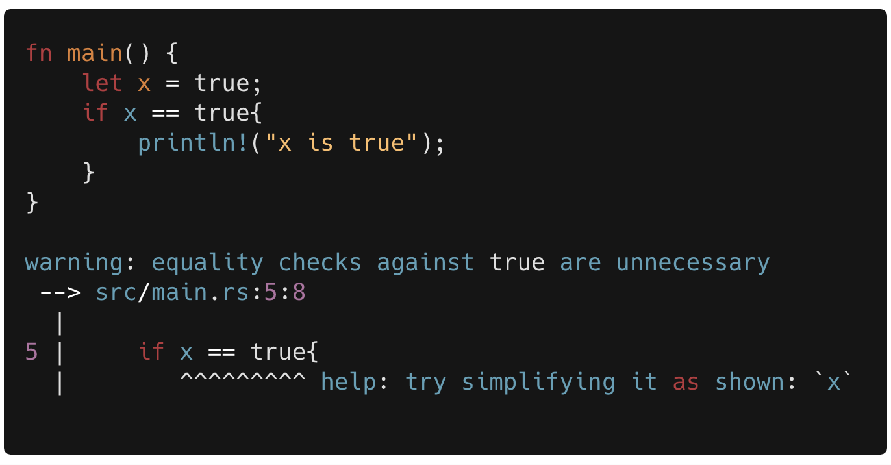
???
```rust
fn main() {
    let x = true;    
    if x == true{
        println!("x is true");
    }
}
```

```
warning: equality checks against true are unnecessary
 --> src/main.rs:5:8
  |
5 |     if x == true{
  |        ^^^^^^^^^ help: try simplifying it as shown: `x`

```

---
# Developer tools

## rustfmt
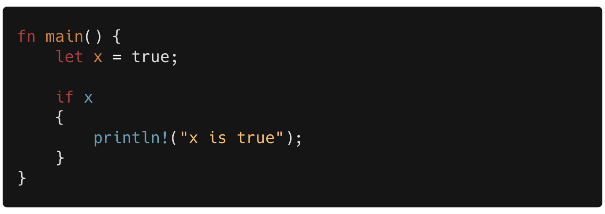

???
```rust
fn main() {
    let x = true;

    if x 
    {
        println!("x is true");
    }
}
```
---
# Developer tools

## rustfmt
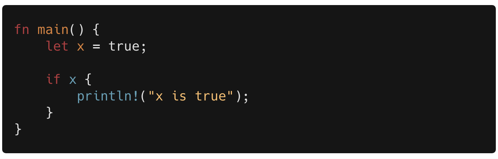


???
```rust
fn main() {
    let x = true;

    if x {
        println!("x is true");
    }
}
```
---
class: impact, dark-mode-cog

# .oxide.small[Beyond the Code]

---

# Community

.center[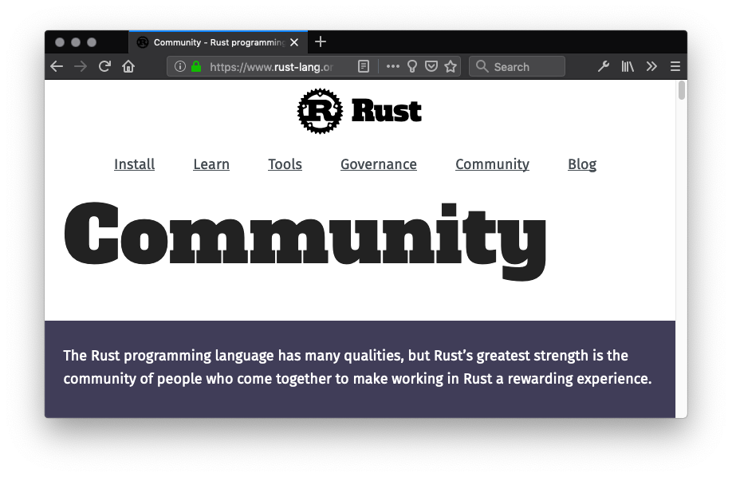]

---

# Community

- IRC
- Discord
- Forums
- Stack Overflow
- Rustbridge

---
# RFC & Roadmap

Community-driven process for "substantial" changes to Rust

---
# Working Groups

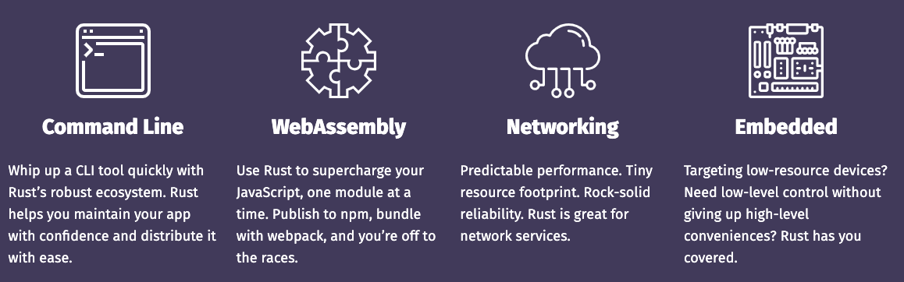 

---


class: impact, dark-mode-cog

# .oxide.small[Who is Using Rust?]

---

# Friends

.center[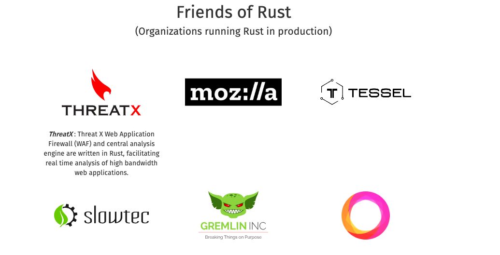]

.small[https://prev.rust-lang.org/en-US/friends.html]


---

class: impact, dark-mode-cog

# .oxide.small[How can YOU get started?]

---

# Learning
--

- The Rust Programming Language

--

- Rustlings

--

- Rust By Example

--

- Application Domain specific guides
    - CLI Book
    - WASM Book
    - Embedded Book

---

# Using Rust
https://play.rust-lang.org/
.center.middle[<iframe src="https://play.rust-lang.org/" width="100%" height="475px">]


---
class: center, middle
.big[
Install it on your system

`rustup`
]

https://www.rust-lang.org/install.html
---
class: impact, dark-mode-cog

# .oxide.small[There is still more to discover]

---
class: impact, dark-mode-cog

# .oxide.small[Quiz]

---
class: impact, dark-mode-cog

# .small[What is the name of Rust's mascot?]

---
class: impact, dark-mode-cog

# .small[What is Rust's most unique feature?]

---
class: impact, dark-mode-cog

# .small[How are Rust developers called?]

---
class: impact, dark-mode-cog

# .oxide.small[Thanks  😀]
---

# Acknowledgement

- Theme inspired by [rocket.rs](https://rocket.rs/)
- Floating Cogs by [Hero Patterns](https://www.heropatterns.com/)
- Content based on [Introduction to Rust](https://gitlab.com/integer32llc/sec-app-dev-2018) by **Jake Goulding**
 and used with permission

---


[i32]: i32.svg
[wd40]: Envase_WD-40.jpg
[metal]: metal.jpg


