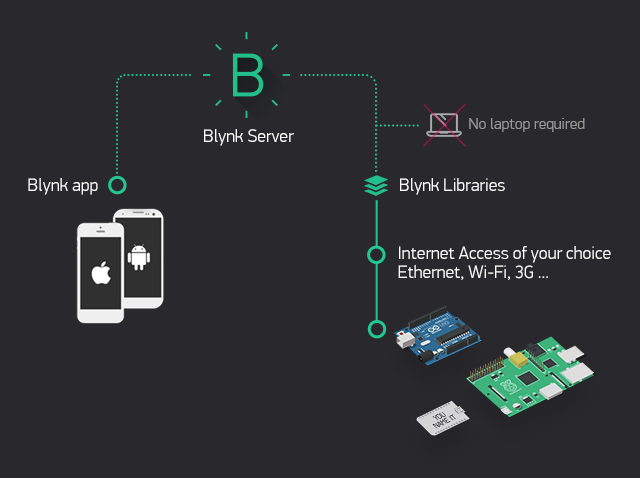
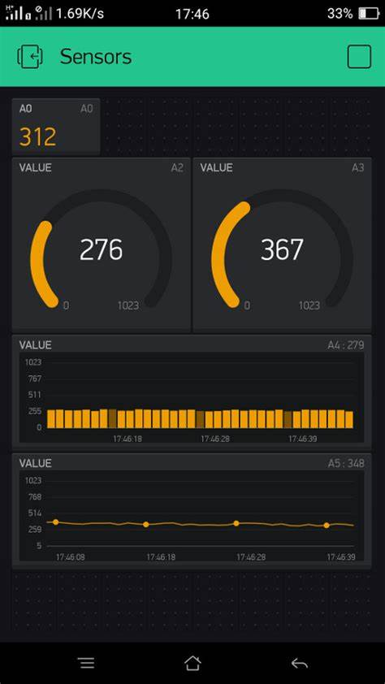

title: Introduction to IoT using Blynk, Rust and your Smartphone
class: animation-fade, dark-mode
layout: true

<!-- This slide will serve as the base layout for all your slides -->
<!-- .bottom-bar[
  {{title}}
] -->

---

class: impact, dark-mode-cog

# .small[{{title}}]

<!-- ### - Rahul Thakoor -->

---
class:middle
# Who am I?

## .big[👋 Hi! I'm Rahul]

--
-  🇲🇺 From Mauritius
--

- Creating **rust_gpiozero**
--

- Physical computing with Rust

--

- Increasing Rust's Reach 2018

---

# Agenda 🗓

- Basic structure of an IoT project
- What is Blynk?
- The Blynk app
- The Blynk Library
- The Blynk API
- reqwest
- Setup
- Blinking a virtual LED

---

class: impact, dark-mode-cog

# .oxide[Basic structure of an IoT project]

---
class: middle

- Sensors
- Actuators
- Microcontrollers/Single Board Computers
- Connectivity
- Processes

---
class: impact, dark-mode-cog
# .oxide[What is Blynk?]

---
class: impact, dark-mode-cog

---
class: impact, dark-mode-cog

# .oxide[Blynk App 📲]
---
class: impact, dark-mode-cog

---
class: impact, dark-mode-cog
# .oxide[The Blynk Library 📚]

---
class: middle,center

## Python
## Javascript/Node
## C++/Arduino

--
 ## Rust?

--

###  🤕 Not yet

---
class: impact, dark-mode-cog
# .oxide[The Blynk API ☁️]

---
class: impact

## https://blynkapi.docs.apiary.io/#

---
class: impact, dark-mode-cog

# .oxide[`reqwest` 📦]

---
class: middle,center

# https://docs.rs/reqwest/0.9.15/reqwest/

---
class: middle,center
# https://rust-lang-nursery.github.io/rust-cookbook/web/clients.html
---

class: impact, dark-mode-cog
# .oxide[Setup ⚙️]

---
class: impact

### ✅ Rust installed on computer
### ✅ Get browser library for Blynk
### ✅ Install Blynk app on smartphone
### ✅ Create a rust project
### ✅ Add `reqwest` as dependency

---
class: impact, dark-mode-cog

# .oxide[Hello Blynk 💡]

---
class: impact, dark-mode-cog

# .oxide[Explore 🚀]

---
class: impact, dark-mode-cog

# .oxide[Where to go from here? 🔀]

---
class: middle, center

## Buy real device
--

## Explore [#rust-embedded](https://www.rust-lang.org/what/embedded)

--

## embedded-hal

--
## rust_gpiozero

--
## Help me port blynk library to `rust`?

---
class: impact, dark-mode-cog

# .oxide[Thanks 🙏🏻]

### Questions?

---
# Acknowledgement

- Theme inspired by [rocket.rs](https://rocket.rs/)
- Floating Cogs by [Hero Patterns](https://www.heropatterns.com/)

